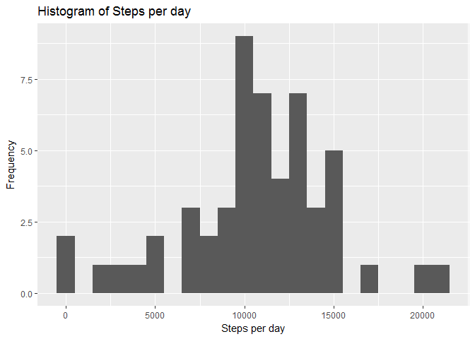
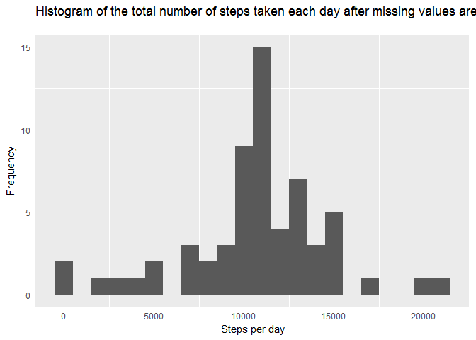

# Reproducible Research: Week 2 Course Project


## Code for reading in the dataset


```r
data <- read.csv("activity.csv", header = TRUE, sep = ',', na.strings="NA", stringsAsFactors=T)
```


## Changing the formating of date column

```r
library(lubridate)
```

```
## Warning: package 'lubridate' was built under R version 3.3.3
```

```
## 
## Attaching package: 'lubridate'
```

```
## The following object is masked from 'package:base':
## 
##     date
```

```r
data$date <- ymd(data$date)
```


## Histogram of the total number of steps taken each day


```r
library(ggplot2)
```

```
## Warning: package 'ggplot2' was built under R version 3.3.3
```

```r
aggregate_data <- aggregate(steps ~ date, data, sum)

ggplot(aggregate_data, aes(x = steps)) +
        geom_histogram(binwidth = 1000) +
        labs(title = "Histogram of Steps per day", x = "Steps per day", y = "Frequency")
```

<!-- -->

## Mean and median number of steps taken each day


```r
mean_steps <- mean(aggregate_data$steps, na.rm = TRUE)

print(mean_steps)
```

```
## [1] 10766.19
```

```r
median_steps <- median(aggregate_data$steps, na.rm = TRUE)

print(median_steps)
```

```
## [1] 10765
```


## Time series plot of the average number of steps taken


```r
aggregate_data_interval <- aggregate(steps ~ interval, data, mean)


ggplot(aggregate_data_interval, aes(x=interval, y=steps)) +
        geom_line(color = "firebrick")
```

<!-- -->


## Time series plot of the average number of steps taken


```r
aggregate_data_interval[which.max(aggregate_data_interval$steps),]
```

```
##     interval    steps
## 104      835 206.1698
```


## Code to describe and show a strategy for imputing missing data


```r
data_full <- data
nas <- is.na(data_full$steps)
avg_interval <- tapply(data_full$steps, data_full$interval, mean, na.rm=TRUE, simplify=TRUE)
data_full$steps[nas] <- avg_interval[as.character(data_full$interval[nas])]
```


## Histogram of the total number of steps taken each day after missing values are imputed


```r
aggregate_data_full <- aggregate(steps ~ date, data_full, sum)


ggplot(aggregate_data_full, aes(x = steps)) +
        geom_histogram(binwidth = 1000) +
        labs(title = "Histogram of the total number of steps taken each day after missing values are imputed
", x = "Steps per day", y = "Frequency")
```

<!-- -->

## Mean and Median after imputing the values

```r
mean_impute <- mean(aggregate_data_full$steps)
print(mean_impute)
```

```
## [1] 10766.19
```

```r
median_impute <- median(aggregate_data_full$steps)
print(median_impute)
```

```
## [1] 10766.19
```


## Panel plot comparing the average number of steps taken per 5-minute interval across weekdays and weekends


```r
library(dplyr)
```

```
## Warning: package 'dplyr' was built under R version 3.3.3
```

```
## 
## Attaching package: 'dplyr'
```

```
## The following objects are masked from 'package:lubridate':
## 
##     intersect, setdiff, union
```

```
## The following objects are masked from 'package:stats':
## 
##     filter, lag
```

```
## The following objects are masked from 'package:base':
## 
##     intersect, setdiff, setequal, union
```

```r
data_full <- mutate(data_full, weektype = ifelse(weekdays(data_full$date) == "Saturday" | weekdays(data_full$date) == "Sunday", "weekend", "weekday"))
data_full$weektype <- as.factor(data_full$weektype)


aggregate_data_full_weekday <- aggregate(steps ~ interval + weektype, data_full, mean)


panel_plot <- ggplot(aggregate_data_full_weekday, aes(x=interval, y=steps, color = weektype)) +
        geom_line() +
        facet_wrap(~weektype, ncol = 1, nrow=2)
print(panel_plot)
```

<!-- -->

